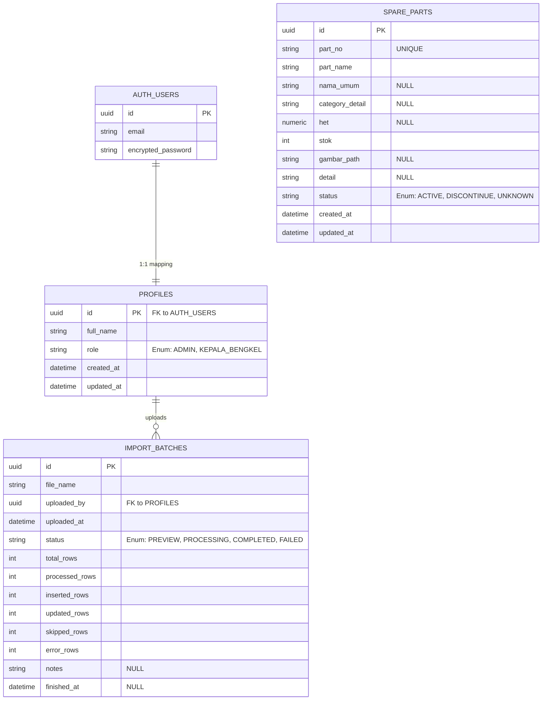

# Entity Relationship Diagram (ERD)

Diagram berikut menjelaskan relasi entitas dalam database AS Putra Rahmat.

## Penjelasan Relasi
- **AUTH_USERS (Supabase Auth)** dikelola secara otomatis oleh Supabase untuk keperluan otentikasi.
- **PROFILES** merupakan ekstensi 1:1 dari `auth.users` untuk menyimpan role dan metadata internal.
- **SPARE_PARTS** merupakan tabel katalog utama. Saat ini tidak memiliki relasi langsung ke entitas lain karena berdiri sebagai master data. Gambar fisik disimpan di Supabase Storage, bukan di PostgreSQL.
- **IMPORT_BATCHES** memiliki relasi N:1 (many-to-one) dengan tabel `PROFILES` (`uploaded_by`), untuk melacak siapa yang melakukan unggahan/import Excel.
